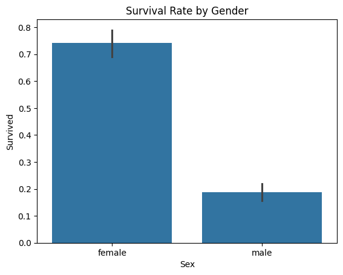
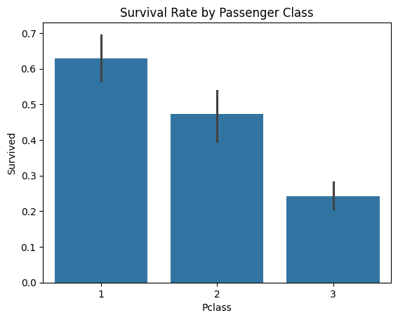
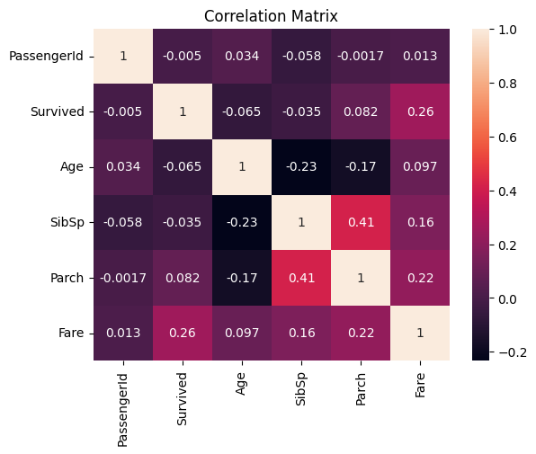

# 🚢 Titanic Survival Analysis  
### Exploratory Data Analysis (EDA) Project  

---

## 📌 Project Overview

This project presents a comprehensive Exploratory Data Analysis (EDA) of the Titanic dataset.  

The objective is to uncover the key factors that influenced passenger survival and extract meaningful insights using structured data analysis and visualization techniques.

Rather than focusing on prediction, this project emphasizes analytical thinking, data storytelling, and insight extraction.

---

## 🎯 Objectives

- Understand overall survival distribution
- Identify the most influential survival factors
- Analyze demographic and socioeconomic variables
- Perform structured data cleaning
- Visualize survival trends clearly and effectively
- Extract actionable insights from raw data

---

## 📊 Dataset Description

The dataset contains passenger-level information including:

- Passenger demographics (Age, Sex)
- Ticket class (Pclass)
- Fare paid
- Family relations (SibSp, Parch)
- Port of embarkation
- Survival outcome

Total records: **891 passengers**

---

## 🧹 Data Cleaning & Preparation

To ensure analytical accuracy:

- Dropped `Cabin` column due to excessive missing values
- Filled missing `Age` values using median imputation
- Filled missing `Embarked` values using mode
- Converted categorical variables to appropriate data types
- Created age groups for structured age analysis

These preprocessing steps improved data consistency and analytical reliability.

---

## 📈 Key Analytical Insights

### 👩 Gender Impact
Gender was the strongest survival determinant.  
Female passengers had significantly higher survival rates than males.

### 🎟 Passenger Class Effect
Survival probability increased with higher socioeconomic class.  
First-class passengers had the highest survival rate, while third-class passengers had the lowest.

### 👑 Combined Gender & Class Influence
First-class females had the highest survival probability.  
Third-class males had the lowest survival rate.

This demonstrates a clear interaction between social class and gender.

### 👶 Age Factor
Children showed relatively higher survival rates compared to adults.  
However, age was less influential than gender and passenger class.

### 💰 Fare Correlation
Fare displayed the strongest positive correlation with survival among numerical features.  
This reflects the indirect impact of socioeconomic status.

---

## 📊 Visualizations Included

- Overall Survival Distribution
- Survival Rate by Gender
- Survival Rate by Passenger Class
- Survival Rate by Gender and Class
- Age Distribution by Survival
- Correlation Matrix Heatmap

All visualizations were designed to support clear data-driven conclusions.

---

## 📷 Sample Visualizations

### Survival by Gender

### Survival by Passenger Class

### Correlation Matrix

---

## 🏁 Final Conclusion

Survival on the Titanic was not random.  

The analysis clearly indicates that:
- Gender was the most influential factor.
- Socioeconomic status significantly affected survival probability.
- Women and first-class passengers were prioritized.
- Numerical variables alone were weaker predictors compared to categorical variables.

This project highlights the power of Exploratory Data Analysis in uncovering meaningful patterns within real-world datasets.

---

## 🛠 Technologies Used

- Python
- Pandas
- NumPy
- Matplotlib
- Seaborn
- Jupyter Notebook / Google Colab

---

## 🚀 Future Improvements

- Feature engineering (Family Size, Title extraction)
- Building predictive models (Logistic Regression, Random Forest, XGBoost)
- Model performance comparison
- Hyperparameter tuning
- Cross-validation implementation

---
